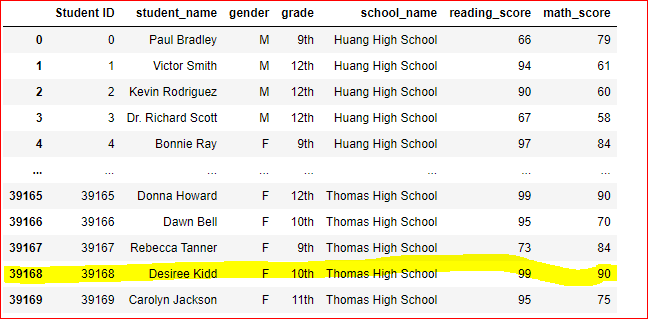
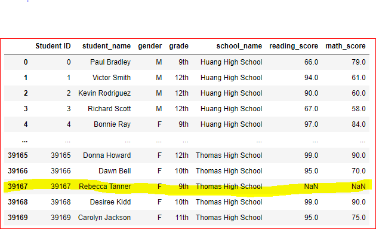
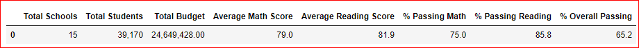
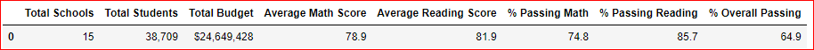
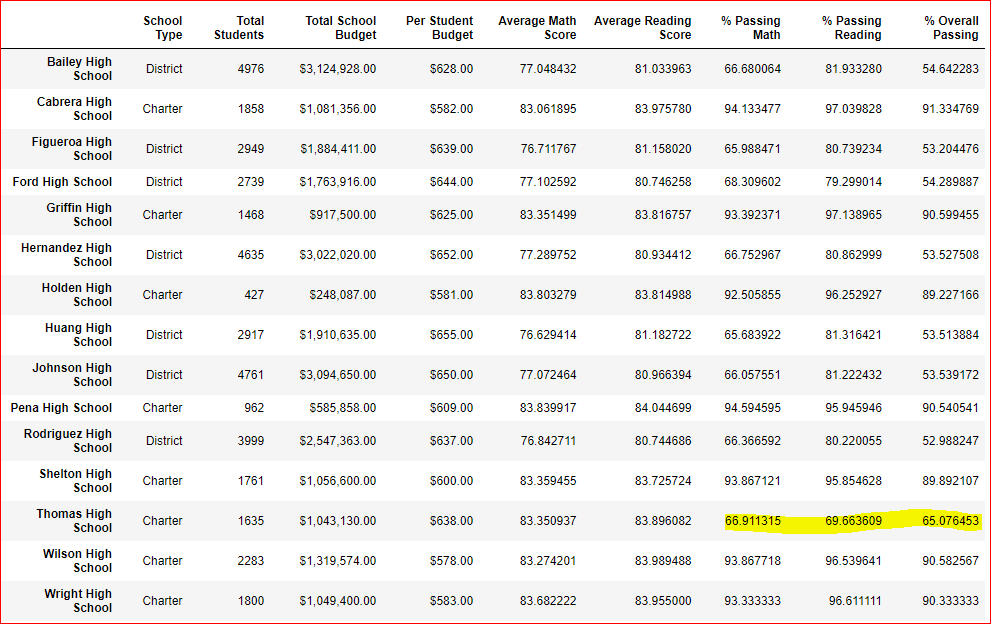
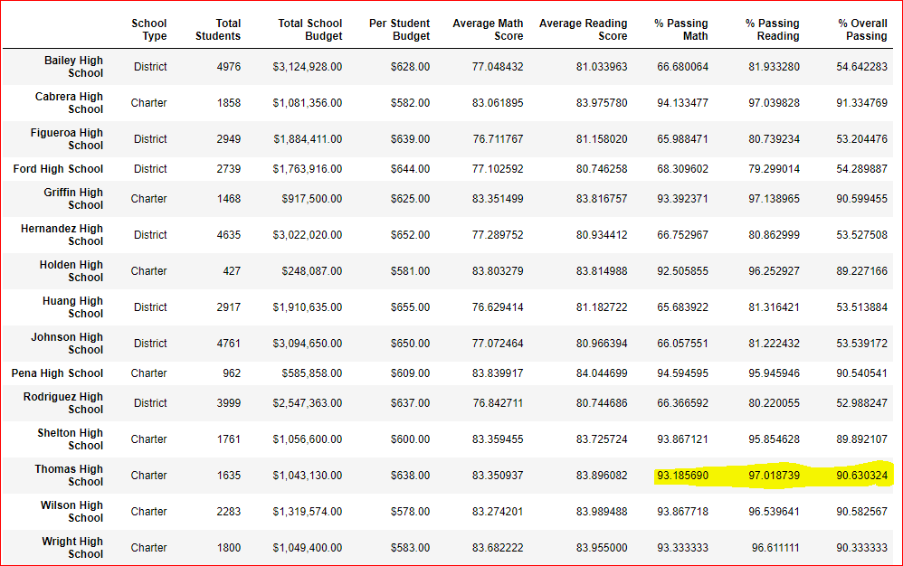

# School District Analysis

## Background
Analyzing the student data &amp; school district budget 
* The data file shows evidence of academic dishonesty in Math & reading scores of Thomas High schools 9th grade.
* The schoolboard want the school district analysis to be rerun after making null the 9th grade score for math & reading for Thomas High School.

## Deliverable 1: Replaceing  Ninth-Grade Reading and Math Scores with Null ( NaN) 
* The student data file before replacing the score

 

Using the "loc' function replaced the math & reading  score of 9th grade students in Thomas High School. 

* The student data file after  replacing the score with Na

## Deliverable 2: The School District Analysis 
### 1. District Summary of the school 
*  Merged the student & school data nto one data frame using the function "merge'.
* Calculated the total budget of the school( sum of the the budget column)
* Calculated the average mat & reading scores of teh student
* Calculated the number of students in 9th grade in Thomas High School & the total number of students in school district. 
* Subtracted the number of student in 9th grade from Thomas High School to get the new total number of students.
* Calculated the passing math & reading score, average math & reading score, percentage of the math & reading score, overall passing percentage of the students( without the 9th grade Thomas High School student)
* Created dataframe for the district school summary.

District School Summary with 9th Grade Thomas High School Students

District School Summary without 9th Grade Thomas High School Students

   
### 2. The School Summary
* Calculated the per capita spending for each school
* Calculated the average math & reading score for each school( using the 'groupby' function)
* Calculated the passing math & reading score & Overall passing.
* Calculated the percenatge of the passing math & reading score & Overall passing.
* Created the dataframe using the above data.

The School Summary with 9th Grade student Thomas High School included

The School Summary with 9th Grade student Thomas High School excluded

### 3. The top 5 and bottom 5 performing schools, based on the overall passing rate
* Using the sort_values function on the overall passing score for the school created data frame for top 5 schools & bottom 5 schools in teh district.

