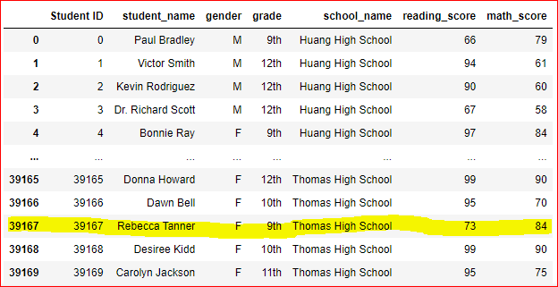
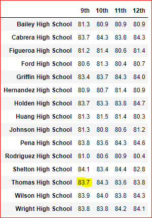

# School District Analysis

## Background

Analyze the student data & school district budget 
* The data file shows evidence of academic dishonesty in math & reading scores of Thomas High School's 9th grade students.
* The school board wants  the school district analysis to be rerun after nullyfying the  math & reading scores for Thomas High School's 9th grade students.
=======
Analyzing the student data & school district budget 
* The data file showed evidence of academic dishonesty in Math & reading scores of Thomas High schools 9th grade.
* The school board wants the school district analysis to be rerun after making the 9th grade score for math & reading 'Null' for Thomas High School.

## Deliverable 1: Replaceing  Ninth-Grade Reading and Math Scores with Null ( NaN) 
* The student data file before replacing the score:

 

Using the "loc' function replaced the math & reading  score of 9th grade students in Thomas High School. 

* The student data file after replacing the score with NaN:

## Deliverable 2: The School District Analysis 
### 1. District Summary of the school 
*  Merged the student & school data file into one data frame using the function "merge".
* Calculated the total budget of the school (sum of the the budget column).
* Calculated the average math & reading scores of high students.
* Calculated the number of students in 9th grade in Thomas High School & the total number of students in school district. 
* Subtracted the number of student in 9th grade from Thomas High School to get the new total number of students.
* Calculated the passing math & reading score, average math & reading score, percentage of the math & reading score, overall passing percentage of the students(without the 9th grade Thomas High School student).
* Created dataframe of district school summary.

District School Summary including 9th Grade Thomas High School students:

District School Summary exculding 9th Grade Thomas High School students:

   
### 2. The School Summary
* Calculated the per capita spending for each school.
* Calculated the average math & reading score for each school (using the 'groupby' function).
* Calculated the number of students passing math, reading and both (70% or more score).
* Calculated the percenatge of students passing math, reading and both.
* Created the dataframe using the above data.

The School Summary including 9th Grade students of Thomas High School students:

The School Summary excluding 9th Grade students of Thomas High School students:

### 3. The five top and bottom performing schools, based on the overall passing rate
* Using the "sort_values" function on the overall passing score for the school, created data frame for top 5 schools & bottom 5 schools in the district.

The top five performing school including 9th grade Thomas High School students:

The top five performing school excluding 9th Grade students of Thomas High School students:

 

The bottom five performing school including 9th grade Thomas High School students:

The bottom five performing school excluding 9th Grade students of Thomas High School students:

### 4. The average math score by grade level for each school
* Created a 'Series' of scores by grade levels using conditionals.
* Created a 'Series' by the school name for the average math score.
* Set the 'index name' to none. 

Grade wise math score including 9th grade Thomas High School students:

Grade wise math score excluding 9th Grade students of Thomas High School students:

### 5. The average reading score by grade level for each school
* Created a 'Series' of scores by grade levels using conditionals.
* Created a 'Series' by the school name for the average reading score .
* Set the 'index name' to none. 

Grade wise reading score including 9th grade Thomas High School students:

Grade wise reading score excluding 9th Grade students of Thomas High School students:

### 6. The scores by school spending per student, by school size, and by school type.
* Using the 'Describe' function , found the minimum & maximum of the per school capita amount.
* created "spending bins' & "group names" for each of the catogories (spending by students, school size & school type).
* created data frame for each catogory & formatted the colums.

 ### 6a. The score by School spending per student
    

   ### 6b.The score by School size

   ### 6c. The score by School type

### Results
* How is the district summary affected?
   * The district school summary changed only marginally, because the ninth grade students in Thomas High School are only 1.1% of the total number of students. 
* How is the school summary affected?
   * The passing percenatge for the math, reading & overall passing  for Thomas High School decreased roughly by 30%.
* How does replacing the ninth graders math and reading scores affect Thomas High School’s performance relative to the other schools?
   * Thomas High School still was still in Top 5 performing schools.
* How does replacing the ninth-grade scores affect the following:
  * Math and reading scores by grade
      * The math & reading grades for the 10-12th  grade didn't change. The ninth grade math & reading school were changed to 'null' as per requirement.
  * Scores by school spending
    * The scores by school spending didn't change.
  * Scores by school size
      * The scores by school size didn't change.
  * Scores by school type
      * The scores by School type didn't change.
### Summary
 * The district school summary changed marginally (1,1%).
 * The school summary changed because the passing percenatage for math, reading & both , decreased by 30% for Thomas High School. 
 * Eventhough the overall scores changed for the Thomas High School, it still was in the top five performing schools.
 * The scores by school spending per student/ per school size/school type didn't change.

